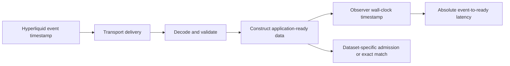

# Methodology

## Measurement question

For a Hyperliquid book event, executed trade, or pre-consensus mempool bundle,
how old is the upstream timestamp when an application at a particular observer
can use the decoded and validated data?

For BBO and L2Book, the collector answers that question independently for
Quicknode gRPC, Hyperliquid Foundation WebSocket, and Hydromancer WebSocket. For
fills, it compares Quicknode gRPC `TRADES` with the Foundation `trades`
WebSocket. It does not report who arrived first as a latency value. All reported
P50/P95/P99 values are absolute milliseconds from the upstream timestamp.

Mempool measures one public customer path: Quicknode gRPC `StreamData` with
`MEMPOOL_TXS` and the `coin=BTC` server-side filter. No other public feed exposes
the same pre-consensus bundle with the same first-seen timestamp, so mempool
does not manufacture a cross-provider cohort or fastest-provider result.



The receipt timestamp is captured immediately after dataset-specific
construction and validation and before the observation enters the bounded
cohort queue. JSON and Protobuf decoding are therefore included for every path.
Cohort matching and Axiom publication are not included in the measured latency.

## Canonical books

Prices and sizes are parsed as decimals and normalized before matching, so
equivalent textual representations compare equal without floating-point
rounding. BBO keys contain the canonical best bid and ask. L2Book keys contain
the ordered canonical bid and ask levels up to depth 20, including price, size,
and order count.

The cohort key is coin plus Hyperliquid event timestamp plus canonical book
content. All three sources must produce the exact same key. A base coin/timestamp
is sealed as a unit after its five-second deadline; a late duplicate or unseen
revision cannot reopen it. Admission order does not select the winning revision.

## Canonical trades

Foundation `trades` messages provide one market-wide trade with coin, trade
timestamp, trade ID, taker side, price, size, hash, and buyer/seller users.
Quicknode's generic `TRADES` stream carries the two account-side fill records
from the same `NodeFillsByBlock` trade. The collector requires one crossed ask
and bid record, validates their common identity and economics, derives the taker
side, and constructs the same buyer/seller ordering.

The fills cohort key is coin plus trade timestamp and ID plus canonical taker
side, price, size, hash, buyer, and seller. Both sources must produce exactly
that key. The receipt boundary is after the full message has been decoded,
validated, paired where necessary, numerically normalized, and converted to the
canonical trade. This measures public trade-feed delivery. It does not measure
customer order submission, acknowledgement, order-to-fill, or exchange
matching-engine execution latency.

## The Quicknode VPC source (fills)

A Quicknode VPC box runs a Hyperliquid node fed by a co-located Quicknode sentry, and the
customer's own client runs on that box. Its fills are measured the only honest way a
co-located path can be: the collector itself runs on the box (`--vpc-node-data <hl/data>`),
subscribes to Quicknode gRPC and the Foundation WebSocket over the network exactly as any
other observer, and additionally tails the node's own `node_fills_by_block` output as the
`quicknode-vpc` provider (`source` `quicknode-vpc`, transport `local`). One process, one
clock, one three-source cohort per trade (`hyperliquid-ws+quicknode-grpc+quicknode-vpc`).

The VPC leg reconstructs each trade from the node's two per-user fills with the rule the
Quicknode gRPC path uses (`parse_quicknode_fill_batch`: same tid, time, coin, price, size and
hash; the crossing fill's side is the taker side; users are buyer then seller), and it is
ready when the line is readable and that reconstruction succeeds — the same canonical-trade
boundary as the gRPC leg. Only lines written after the collector started are timed.

What this does and does not claim: it compares three delivery paths of the same executed
fill at one observer that happens to be the VPC box; the VPC leg's advantage is the absence
of a network hop and of a provider pipeline, not a faster matching engine. Runner identity is
public like every other runner (`teraswitch-nrt-01`, cloud `teraswitch`), and the
`quicknode-vpc` provider can only be stamped by a collector on such a box, so it never
appears from a network observer. Outcome columns for it are `outcome_quicknode_vpc_*`; it is
not folded into the Quicknode family because both Quicknode paths are present in one cohort.

## Mempool bundle readiness

Each Quicknode mempool response contains one of the production JSON shapes:

```text
[first-seen timestamp, transaction bundle]
{first_seen_time, tx_hash, signed_actions, ...}
```

The collector subscribes through the public tenant endpoint over TLS, requests
`MEMPOOL_TXS`, and sends a server-side `coin=BTC` filter. A response is admitted
only after the entire JSON value has decoded, its first-seen timestamp has
parsed, the transaction hash is valid, and `signed_actions` is a non-empty array
of objects. The collector independently verifies that a documented
order-touching action references BTC asset ID `0`; the
`mempool-bundle-ready-v1` contract intentionally supports exactly BTC. The
observer wall-clock timestamp is captured immediately after those checks and
before the bounded event queue.

The reported latency is:

```text
observer decoded-bundle-ready UTC - embedded mempool first-seen timestamp
```

This end-to-end observer measurement includes public routing, TLS, gRPC
delivery, Protobuf decoding, JSON decoding, and validation. It is not a
server-only processing metric. The source sometimes expresses UTC without an
offset; in that established stream format the collector interprets the value as
UTC. Millisecond precision is used consistently with the other datasets.

The filter selects bundles containing a matching BTC action; the response
remains the production bundle. One response therefore contributes one sample,
regardless of how many signed actions the bundle contains. Raw payloads and
transaction hashes remain in bounded process memory only and are never written
to the outbox or Axiom. The in-memory identity includes the transaction hash so
distinct bundles first seen within the same millisecond remain distinct samples.


## Peering block readiness

The `peering` dataset measures plain TCP subscribers connected to peering
service endpoints, consuming Hyperliquid's native gossip wire stream exactly
as any peered node would. The collector connects as a provisioned peering
customer of each service it dials: its observer source address is registered
with the service and it receives the full-speed stream, so every published
value is the delivery latency a peering customer experiences — no synthetic
allowances in either direction.

One process dials one service (an absolute measurement with no
fastest-provider share, like mempool) or, in comparison mode, two services at
once. In comparison mode both subscriptions run in the same process on the
same observer, share the same clock and the same reference feed, and stop at
the same block-ready boundary. Every consensus round is one exact two-source
cohort: only rounds both services delivered within the cohort deadline enter
the latency distributions, a round one service never delivered is counted
against that service as missing, and the fastest-provider share is the
strictly-first service per round, exactly as for the book datasets. Because
peering content is the round number itself, neither service is treated as the
canonical reference; the cohort is symmetric.

A block is **ready** when its ordering record has been received and parsed
(consensus round plus the list of referenced transaction bundles) and every
referenced bundle has been received, decompressed, and validated. The observer
wall-clock timestamp is captured at the last required arrival, before the
bounded event queue, so transport, framing, decompression, and validation are
included consistently with the other datasets.

```text
peering: observer block-ready UTC - block producer timestamp
```

Two per-round facts are not decodable from the wire and come from a reference
feed instead: the block's producer timestamp, and each referenced bundle's
leading signature value, which the collector matches against the first record
of each wire bundle. Both facts are deterministic chain data — every
Hyperliquid node's replay output records them byte-identically — so anyone can
reproduce the reference feed from any node. Arrival timestamps are always
captured live at the socket; the reference feed only closes a sample after the
fact, so feed lag delays reporting but never distorts a latency value. One
consensus round contributes at most one sample; a round that does not complete
within the five-second cohort deadline is counted through `sequence_gaps`
rather than guessed, and can never enter a latency distribution late.

Peering measures consensus blocks rather than a market, so the process
contract pins the coin label `BLOCKS`. Hyperliquid produces roughly fifteen
rounds per second, comfortably inside the mempool-class state limits, and the
1,000-sample P99 gate is reached in under two minutes of healthy stream.
Quicknode operates both the measured service and this benchmark; the dataset
is published with that disclosure, and readers who require an adversarial
measurement can reproduce it with this collector from their own vantage.

## Reference and admission sets

For BBO, L2Book, and fills, Foundation defines the reference event universe used
for coverage. Accordingly, Foundation's own coverage is labeled “reference
set,” not presented as a provider availability percentage. Other active-source
coverage means “matched to the Foundation reference.”

Latency distributions contain only complete, content-identical cohorts across
all active sources: three for books and two for fills. This makes provider
distributions comparable, but it also creates an explicit selection condition:
events missing or mismatched on any active path are excluded from every latency
distribution in that dataset. Coverage and failure counters must be interpreted
beside the quantiles.

Mempool has one active and reference source, Quicknode gRPC. A valid bundle is
settled immediately rather than waiting for the five-second multi-source cohort
deadline. Its `matched_count` is therefore the rolling count of valid admitted
bundles, not a match to Foundation.

## Rolling distributions

The collector retains the raw complete-cohort latencies in an exact bounded
five-minute ring. Every 30 seconds it calculates:

- minimum and maximum;
- arithmetic mean and population standard deviation;
- nearest-rank P50, P95, and P99; and
- P99 minus P50 tail spread.

For sorted values `x[1..N]`, percentile `p` is `x[ceil(p*N)]`, with the rank
clamped to `1..N`. No histogram interpolation or zero fill is used. Missing data
remains missing. P99 is public-ready only with at least 1,000 complete samples;
P50 and P95 may be shown while that sample gate is warming, with scope labeled.

Successive chart points are overlapping five-minute rolling distributions. They
describe how the selected rolling statistic changes; they are not independent
samples and cannot be re-percentiled to obtain an exact selected-range P99.

## Non-overlapping cohort outcomes

Each 30-second publication interval has one deterministic interval identity and
counts each complete cohort exactly once. The exact same interval fields are
repeated on every provider row only to preserve the logical dataset window.
Consumers first require all expected copies to agree, then count the interval
once.

For each complete cohort, the provider with the lowest integer-millisecond
absolute latency receives one strict-fastest count. If multiple paths share
the minimum, the cohort increments the explicit tie count and no provider.
Strict-fastest counts plus ties therefore equal the complete interval cohort
count. Selected-range shares are sums of these non-overlapping counts, never
comparisons of rolling P99 values.

The first publication after process start covers a partial interval and is
marked incomplete. It is not included in complete selected-range evidence.

Mempool has no provider comparison. Its `outcome_count_scope` is
`not-applicable`, all fastest/tie counts are zero, and dashboards must not render
a fastest-share view for that dataset.

## Clock gate

Absolute latency requires an accurate observer clock. At every publication the
collector reads Chrony tracking state and emits synchronization, stratum, leap
status, system-time offset, and a conservative error-bound estimate.

A window is not public-ready unless Chrony reports a valid external source,
normal leap status, a finite system-time offset, and a conservative clock error
bound no larger than 5 ms. The bound is the absolute system-time offset plus
root dispersion plus half the root delay. Deployment also verifies
`NTPSynchronized=yes`, but that startup check does not replace the runtime gate.
Negative latency and implausibly future event timestamps are rejected and
counted; they are never clamped to zero.

## Publication and replay

One process handles each of BBO, L2Book, fills, and mempool. Connections persist
across publication intervals and reconnect only after a real failure. Every
atomic window is fsynced to a bounded disk outbox, renamed into place, and
delivered oldest-first. An operating-system lock gives each dataset outbox
exactly one writer. Ambiguity after the durable rename is fatal so the
supervisor restarts the process instead of silently losing a window. A fully
acknowledged file is never posted again: local unlink or directory-fsync cleanup
is retried locally.

Fills use dataset-specific state limits sized for an aggregate 1,000 matched
cohorts per second across the five-minute window: 300,000 rolling cohorts,
400,000 settled entries for mismatch and replay headroom, and 25,000 pending
bases for 25 seconds of burst capacity. A one-second maintenance tick settles
bases after the five-second cohort timeout independently of the thirty-second
publication cadence, so normal pending occupancy at the design rate stays near
6,000 or below. When multiple coins share a fills process, the rolling limit is
divided across them so the process-wide memory envelope stays bounded. Book
datasets retain their lower event-rate limits. Any cap eviction is published as
integrity loss rather than silently producing a percentile.

Mempool settles each valid one-source bundle immediately and has rolling
capacity for 200 bundles per second across the five-minute process envelope:
75,000 rolling cohorts and 80,000 settled entries provide timing and replay
headroom above the 60,000 samples implied by that design rate. The
initial production assignment is one coin, BTC, per process.

Delivery is deliberately at least once. A partial acknowledgement or a lost
response can cause a complete immutable batch to be posted again. `event_id` is
deterministic for measurement schema, run, window, and provider, so a normal
replay has the same identity and payload. Consumers compare every field that can
affect eligibility or rendered output, collapse equivalent retries, reject a
duplicate identity that conflicts on any of those fields, and reject ambiguous
same-timestamp windows before any percentile or outcome is displayed.

## Provenance

Every event identifies the benchmark package version, measurement version,
source commit, optional artifact SHA-256, public runner, run, window, and exact
schema. A public dashboard may link an exact source commit only when that commit
is present and syntactically valid; “unavailable” is displayed honestly during
an unversioned development build.
