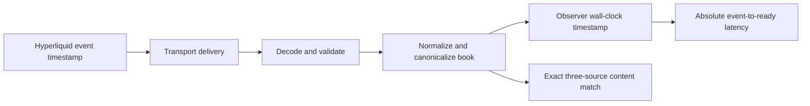

# Methodology

## Measurement question

For a Hyperliquid book event, how old is the event timestamp when an application
at a particular observer can use the decoded and canonicalized book?

The collector answers that question independently for Quicknode gRPC,
Hyperliquid Foundation WebSocket, and Hydromancer WebSocket. It does not report
who arrived first as a latency value. All reported P50/P95/P99 values are
absolute milliseconds from the event timestamp.

The receipt timestamp is captured immediately after canonical construction and
before the event enters the bounded cohort queue. JSON and Protobuf decoding are
therefore included for every path. Cohort matching and Axiom publication are not
included in the measured latency.

## Canonical books

Prices and sizes are parsed as decimals and normalized before matching, so
equivalent textual representations compare equal without floating-point
rounding. BBO keys contain the canonical best bid and ask. L2Book keys contain
the ordered canonical bid and ask levels up to depth 20, including price, size,
and order count.

The cohort key is coin plus Hyperliquid event timestamp plus canonical book
content. All three sources must produce the exact same key. A base coin/timestamp
is sealed as a unit after its five-second deadline; a late duplicate or unseen
revision cannot reopen it. Admission order does not select the winning revision.

## Foundation reference set

Foundation defines the reference event universe used for coverage. Accordingly,
Foundation's own coverage is labeled “reference set,” not presented as a
provider availability percentage. Quicknode and Hydromancer coverage mean
“matched to the Foundation reference.”

Latency distributions contain only complete, content-identical three-source
cohorts. This makes the three provider distributions comparable, but it also
creates an explicit selection condition: events missing or mismatched on any
path are excluded from all three latency distributions. Coverage and failure
counters must be interpreted beside the quantiles.

## Rolling distributions

The collector retains the raw complete-cohort latencies in an exact bounded
five-minute ring. Every 30 seconds it calculates:

- minimum and maximum;
- arithmetic mean and population standard deviation;
- nearest-rank P50, P95, and P99; and
- P99 minus P50 tail spread.

For sorted values `x[1..N]`, percentile `p` is `x[ceil(p*N)]`, with the rank
clamped to `1..N`. No histogram interpolation or zero fill is used. Missing data
remains missing. P99 is public-ready only with at least 1,000 complete samples;
P50 and P95 may be shown while that sample gate is warming, with scope labeled.

Successive chart points are overlapping five-minute rolling distributions. They
describe how the selected rolling statistic changes; they are not independent
samples and cannot be re-percentiled to obtain an exact selected-range P99.

## Non-overlapping cohort outcomes

Each 30-second publication interval has one deterministic interval identity and
counts each complete cohort exactly once. The exact same interval fields are
repeated on the three provider rows only to preserve the logical three-row window.
Consumers first require all three copies to agree, then count the interval once.

For each complete cohort, the provider with the lowest integer-millisecond
absolute latency receives one strict-fastest count. If two or three paths share
the minimum, the cohort increments the explicit tie count and no provider.
Strict-fastest counts plus ties therefore equal the complete interval cohort
count. Selected-range shares are sums of these non-overlapping counts, never
comparisons of rolling P99 values.

The first publication after process start covers a partial interval and is
marked incomplete. It is not included in complete selected-range evidence.

## Clock gate

Absolute latency requires an accurate observer clock. At every publication the
collector reads Chrony tracking state and emits synchronization, stratum, leap
status, system-time offset, and a conservative error-bound estimate.

A window is not public-ready unless Chrony reports a valid external source,
normal leap status, a finite system-time offset, and a conservative clock error
bound no larger than 5 ms. The bound is the absolute system-time offset plus
root dispersion plus half the root delay. Deployment also verifies
`NTPSynchronized=yes`, but that startup check does not replace the runtime gate.
Negative latency and implausibly future event timestamps are rejected and
counted; they are never clamped to zero.

## Publication and replay

One process handles BBO and another handles L2Book. Connections persist across
publication intervals and reconnect only after a real failure. Every atomic
window is fsynced to a bounded disk outbox, renamed into place, and delivered
oldest-first. An operating-system lock gives each dataset outbox exactly one
writer. Ambiguity after the durable rename is fatal so the supervisor restarts
the process instead of silently losing a window. A fully acknowledged file is
never posted again: local unlink or directory-fsync cleanup is retried locally.

Delivery is deliberately at least once. A partial acknowledgement or a lost
response can cause a complete immutable batch to be posted again. `event_id` is
deterministic for measurement schema, run, window, and provider, so a normal
replay has the same identity and payload. Consumers compare every field that can
affect eligibility or rendered output, collapse equivalent retries, reject a
duplicate identity that conflicts on any of those fields, and reject ambiguous
same-timestamp windows before any percentile or outcome is displayed.

## Provenance

Every event identifies the benchmark package version, measurement version,
source commit, optional artifact SHA-256, public runner, run, window, and exact
schema. A public dashboard may link an exact source commit only when that commit
is present and syntactically valid; “unavailable” is displayed honestly during
an unversioned development build.
